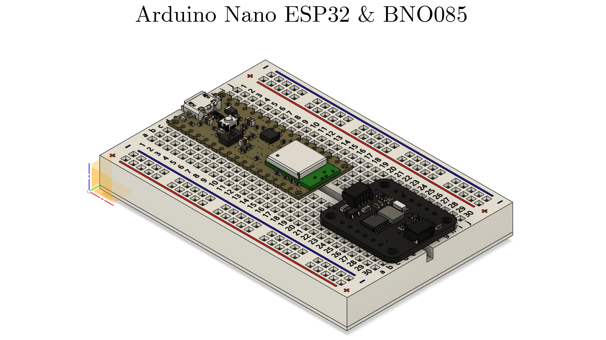

# Nikhil J. Babani

**Location**: London, UK  
**Email**: [nikhil.babani.20@ucl.ac.uk](mailto:nikhil.babani.20@ucl.ac.uk)  
**Phone**: [+44 77784 23213](tel:+447778423213)

## Education

### University College London (UCL), London, UK
**Master of Electronic & Electrical Engineering with Minor in Engineering Mathematics**  
**September 2020 – June 2025**  
- **Grade**: 1st Class Honours (GPA: 3.91/4.0)
- Ranked 1st out of 154 in Year 3 and 15th out of 154 in Year 2
- Ranked 3rd in Robotics for Electronic Engineering and 4th in Control Systems I
- Activities: UCL Robotics Society Treasurer, UCL Fleming Society Member

### Kolej Tuanku Ja'afar, Negeri Sembilan, Malaysia  
**International A-levels**  
**January 2019 – June 2020**  
- **Grade**: 3A*A in Mathematics, Physics, Chemistry, and Further Mathematics
- Awarded KTJ Internal Scholarship for scoring 8A*s during the IGCSE examinations
- Activities: School Prefect, Vice House Captain, House Basketball Captain, PTPI Member

## Research Experience

### Master's Research Project, UCL
**September 2024 – Present**  
Supervised by Professor Sarah K. Spurgeon OBE FREng & Dr. Francesca Boem
- Investigating the prevention of Vertical Displacement Events in Tokamak Fusion Reactors
- Developing and analyzing the RZIp model and evaluating control systems
- Learning optimal control policies to improve reactor performance

### Undergraduate Researcher, UCL
**July 2024 – Present**  
Supervised by Professor Simon J. Julier, Dr. Kevin Chetty & Dr. Martin Magnusson
- Maximizing SNR and Doppler shift through dynamic positioning of transmitter and receiver  
- Utilized RADAR equations and simulated ovals of Cassini for through-wall tracking

### Bachelor's Thesis, UCL
**September 2023 – April 2024**  
Supervised by Professor John E. Mitchell  
- Developed an indoor pedestrian navigation system using BLE and 6-DOF IMU data  
- Compared Kalman and Particle Filters for tracking nonlinear systems, achieving a positional error of 0.9952 m (75th percentile error: 1.3311 m)

## Professional Experience

### Mathematics Tutor, TUTTEE Academy
**July 2023 – Present**  
- Conducted 1-on-1 tutoring for IB MYP Mathematics
- Created study material encompassing theoretical concepts and practical applications

### Data Science Work Placement, Pulsifi, Kuala Lumpur, MY
**August 2019**  
- Worked on an AI model for CV automation in Python
- Aided in model training by categorizing CV data for machine learning

## Projects

### Maze Solving Robot, UCL
**August 2022 – September 2022**  
- Utilized a Wheatstone bridge with an inverting amplifier circuit for wall sensing
- Analyzed robot motor winding with L = 0.5 mH and R = 1 Ω, calculating current response and energy dissipation
- Designed a Moore finite state machine to control robot movements

### Pick-and-Place Robot with Vision, UCL
**October 2023 – December 2023**  
- Applied DH parameters for forward kinematics and inverse kinematics
- Implemented Laplacian edge detection and trajectory planning for object detection

### Predicting Hospital Readmission, UCL
**November 2023 – January 2024**  
- Deployed sampling methods like SMOTE-TL for class imbalance correction  
- Applied machine learning models including KNN, Random Forest, and XGBoost, improving accuracy by 21%

## References

- **Professor Simon J. Julier**  
Professor of Computer Science, UCL  
Email: [s.julier@ucl.ac.uk](mailto:s.julier@ucl.ac.uk)

- **Dr. Kevin Chetty**  
Associate Professor of Security and Crime Science, UCL  
Email: [k.chetty@ucl.ac.uk](mailto:k.chetty@ucl.ac.uk)

- **Professor Chow Yin Lai**  
Teaching Fellow in Robotics, UCL  
Email: [c.lai@ucl.ac.uk](mailto:c.lai@ucl.ac.uk)

- **Professor John E. Mitchell**  
Head of Department, Electronic and Electrical Engineering, UCL  
Email: [j.mitchell@ucl.ac.uk](mailto:j.mitchell@ucl.ac.uk)
